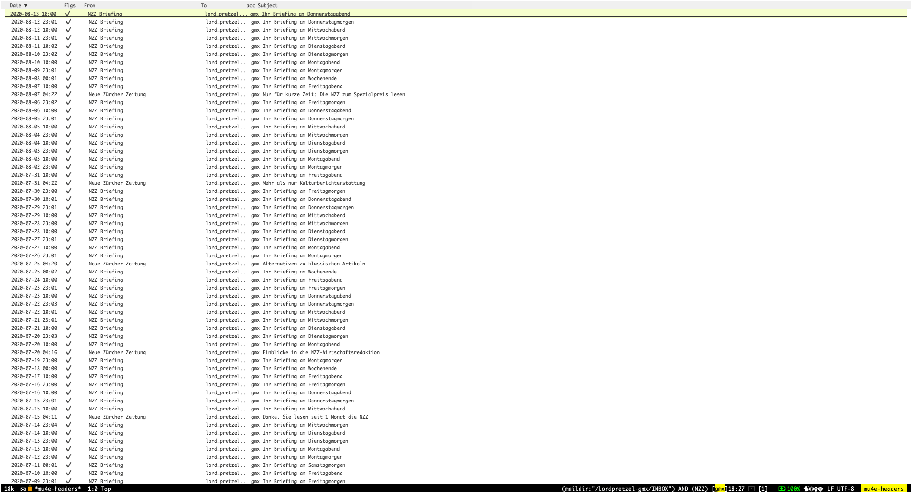

 <!--  --> <!--  -->  

# mu4e-views

 [mu4e](https://www.djcbsoftware.nl/code/mu/mu4e.html) is great, but viewing of html emails is suboptimal.  This packages enables the user to choose how to view emails.  It's main use case is to view html emails using an xwidgets window, but custom viewing methods are also supported.

Also provides methods to access content extracted from an email, e.g., urls or attachments. This makes it easier to build user defined viewing methods.

## Installation

### MELPA

Symbol’s value as variable is void: $1 is available from MELPA (both
[stable](http://stable.melpa.org/#/mu4e-views) and
[unstable](http://melpa.org/#/mu4e-views)).  Assuming your
`package-archives` lists MELPA, just type

~~~sh
M-x package-install RET mu4e-views RET
~~~

to install it.

### Prerequisites

If you are not installing from [melpa](http://melpa.org/#/mu4e-views) you have to install the dependency [xwidgets-reuse](https://github.com/lordpretzel/xwidgets-reuse) first. Also this uses `xwidget`, so you can only use this package if your emacs has been compiled with support for `xwidget`. If you are unsure whether this is the case try running: `(xwidget-webkit-browse-url "https://www.gnu.org/")`.

### Quelpa

Using [use-package](https://github.com/jwiegley/use-package) with [quelpa](https://github.com/quelpa/quelpa).

~~~elisp
(use-package
  :quelpa ((mu4e-views
    :fetcher github
    :repo "lordpretzel/mu4e-views")
  :upgrade t)
)
~~~

### straight

Using [use-package](https://github.com/jwiegley/use-package) with [straight.el](https://github.com/raxod502/straight.el)

~~~elisp
(use-package mu4e-views
  :straight (mu4e-views :type git :host github :repo "lordpretzel/mu4e-views"))
~~~

### Source

Alternatively, install from source. First, clone the source code:

~~~sh
cd MY-PATH
git clone https://github.com/lordpretzel/mu4e-views.git
~~~

Now, from Emacs execute:

~~~
M-x package-install-file RET MY-PATH/mu4e-views
~~~

Alternatively to the second step, add this to your Symbol’s value as variable is void: \.emacs file:

~~~elisp
(add-to-list 'load-path "MY-PATH/mu4e-views")
(require 'mu4e-views)
~~~

## Usage

This package changes the way how `mu4e` shows emails when selecting an email from the `mu4e-headers` view. The main purpose of this package is to enable viewing of `html` emails in `xwidgets-webkit`, but is also possible for a user to define new custom views. Once a view is selected, you just use `mu4e` as usual and emails selected in the `headers` view are shown using the currently active view method.

### Setup

After the package is loaded, you can call `mu4e-views-mu4e-select-view-msg-method` from the `mu4e-headers` view to select the method to use for viewing. Per default `mu4e-view` supports:

- `html` - uses `xwidgets` to show the email
- `text` - the default `mu4e` method for viewing emails that translates the email into text
- `browser` - open the email using `browse-url`, e.g., in your system browser

You may want to bind this to a key in `mu4e-headers-mode-map`.

~~~elisp
(define-key mu4e-headers-mode-map (kbd "v") 'mu4e-views-mu4e-select-view-msg-method)
~~~

Here is an example setup:

~~~elisp
(use-package mu4e-views
  :after mu4e
  :defer nil
  :quelpa ((mu4e-views
            :fetcher github
            :repo "lordpretzel/mu4e-views")
           :upgrade t)
  :bind (:map mu4e-headers-mode-map
	    ("v" . mu4e-views-mu4e-select-view-msg-method) ;; select viewing method
	    ("M-n" . mu4e-views-cursor-msg-view-window-down) ;; from headers window scroll the email view
	    ("M-p" . mu4e-views-cursor-msg-view-window-up) ;; from headers window scroll the email view
	    )
  :config
  (setq mu4e-views-completion-method 'ivy) ;; use ivy for completion
  (setq mu4e-views-default-view-method "html") ;; make xwidgets default
  (mu4e-views-mu4e-use-view-msg-method "html") ;; select the default
  (setq mu4e-views-next-previous-message-behaviour 'stick-to-current-window) ;; when pressing n and p stay in the current window
  )
~~~

### Settings

- `mu4e-views-completion-method` - framework used for completion.
- `mu4e-views-mu4e-html-email-header-style` - CSS style for showing the header of an email (`mu4e-views` injects this header into the html text of the email). Customize to change appearance of this header.
- `mu4e-views-next-previous-message-behaviour` - per default `mu4e` switches from the `headers` window to the `view` window once an email is opened, e.g., by pressing `n`. This option customizes this behavior:
  - `always-switch-to-headers` - always switch back the `headers` window
  - `always-switch-to-view` - always switch back the `view` window (default behavior of `mu4e`)
  - `stick-to-current-window` - stay in the current window (`headers` or `views`)
- `mu4e-views-inject-email-information-into-html` - if `t`, then create a header shown on top of the html message with useful information from the email
- `mu4e-views-view-commands` - the view methods supported by `mu4e-views`. Customize to add new methods.
- `mu4e-views-default-view-method` - the default method for viewing emails.

### xwidgets view

Several keys are bound in this view to store attachments, open attachments, go to urls in the email similar to the regular `mu4e` view window.

- `q`: `mu4e-views-mu4e-headers-windows-only` - quit view window
- `n`: `mu4e-views-mu4e-headers-next` - move to next message
- `p`: `mu4e-views-mu4e-headers-prev` - move to previous message
- `o`: `mu4e-views-mu4e-view-open-attachment` - open an attachment
- `g`: `mu4e-views-mu4e-view-go-to-url` - go to URL from email
- `k`: `mu4e-views-mu4e-view-save-url` - save URL
- `e`: `mu4e-views-mu4e-view-save-attachment` - save an attachment
- `E`: `mu4e-views-mu4e-view-save-all-attachment` - save all attachments
- `a`: `mu4e-views-mu4e-view-action` - call a `mu4e` view action
- `f`: `mu4e-views-mu4e-view-fetch-url` - fetch URL from email

#### Synergy with `xwwp`

To use your keyboard to click on links in an email shown in `xwidgets`, you can use the excellent [xwwp](https://github.com/canatella/xwwp) package.

### Define custom views

To define a new view, you need to create a function `my-view-func(html msg win)` that uses window `win` to show the message. `html` is the name of a file storing `html` text of the message. If `mu4e-views-inject-email-information-into-html` is `t` then `mu4e-views` injects a header into the html code to show some basic information about the email (e.g., sender, attachments, ...). `msg` is a `mu4e` internal message object. You can use it to extract additional information about the email to be shown. Please refer to the  [mu4e](https://www.djcbsoftware.nl/code/mu/mu4e.html) and `mu4e-views` source code to see how this works. To make `mu4e-views` aware of your new view method add it to `mu4e-views-view-commands` giving it a user-facing name. The format is `(cons name plist)`. Methods that do not show the email in emacs should set `:no-view-window t` which instructs `mu4e-views` to not create a window for viewing the email. Any view methods needs to set `:viewfunc` to a function `my-view-func(html msg win)`. For example,

~~~elisp
(add-to-list 'mu4e-views-view-commands (:viewfunc 'my-view-func))
~~~

`mu4e-views` provides several helper functions for doing typical things with emails such as storing attachments as described above. These functions can be used in custom views too.
